# 🏛️ The Software Architecture Masterclass

A comprehensive, curated roadmap of the literature defining modern system design. This repository is organized chronologically within socio-technical layers, shifting the focus from "what to read" to "how to evolve" as an architect.

> "Architecture is the decisions that are hard to change later." — **Jeff Vogel**

---

## 📑 Curriculum Overview

- [1. Architectural Thinking & Foundations](#architectural-thinking--foundations)
- [2. Tactical Design & Component Modeling](#tactical-design--component-modeling)
- [3. Domain-Driven Design (Strategic & Tactical)](#domain-driven-design)
- [4. Microservices & Distributed Patterns](#microservices--distributed-patterns)
- [5. Streaming and Messaging](#streaming-and-messaging)
- [6. Data Engineering & Persistence Strategies](#data-engineering--persistence-strategies)
- [7. Cloud Native & Resiliency Engineering](#cloud-native--resiliency-engineering)
- [8. Socio-Technical Architecture & Leadership](#socio-technical-architecture--leadership)
- [9. General Articles, Books, and Posts](#general-articles-and-books-and-posts)

---

## 🔬 Curation Philosophy

This index follows a **Concept-First** approach. Inclusion is based on:

*   **Abstraction over Implementation:** We prioritize books that teach "Why" and "How" over specific framework syntax.
*   **Historical Significance:** Foundational pillars that have influenced the last 30 years of engineering.
*   **Community Validation:** High-density knowledge verified by senior practitioners globally.

---

## Architectural Thinking & Foundations
*The "Mindset" layer: Understanding trade-offs, quality attributes (-ilities), and technical debt.*

|Image | Publ.| ISBN          | Type | Title                                                           | Rating                                            | Raters | Authors |
|:---- | :--- | :------------ | :--- | :-------------------------------------------------------------- | :-------------------------------------------------- | :---   | :--- |
| | 2021 | 0785342154955 | Book | Software Architecture in Practice, 4th Edition                  | [3.82](https://www.goodreads.com/book/show/70143) | 608    | Len Bass, Paul Clements, Rick Kazman |
| | 2020 | 9781492043454 | Book | Fundamentals of Software Architecture: An Engineering Approach  | [4.40](https://www.goodreads.com/book/show/44144493) | 364 | Mark Richards, Neal Ford |
| | 2020 | 9781492077541 | Book | The Software Architect Elevator                                 | [4.48](https://www.goodreads.com/book/show/49828197) | 101 | Gregor Hohpe |
|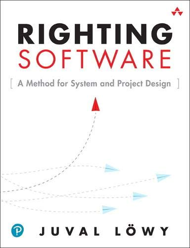 | 2019 | 9780136524038 | Book | Righting Software                                               | [3.79](https://www.goodreads.com/book/show/51109185) | 76 | Juval Löwy |
| | 2017 | 9780134494166 | Book | Clean Architecture                                              | [4.23](https://www.goodreads.com/book/show/18043011) | 3662 | Robert C. Martin |
| | 2017 | 9781491986363 | Book | Building Evolutionary Architectures                             | [3.74](https://www.goodreads.com/book/show/35755822) | 705 | Neal Ford, Rebecca Parsons, Patrick |
|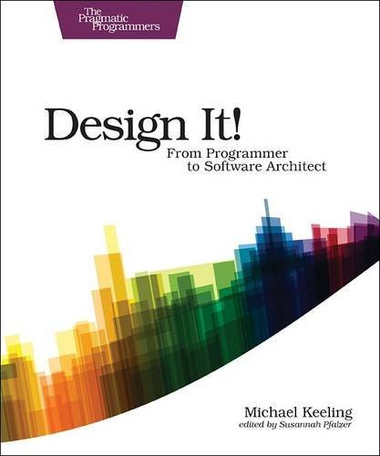 | 2017 | 9781680502091 | Book | Design It!: From Programmer to Software Architect               | [3.68](https://www.goodreads.com/book/show/31670678) | 168 | Michael Keeling |
|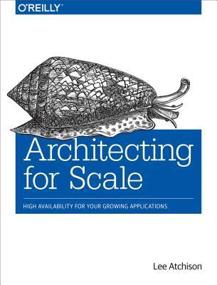 | 2016 | 9781491943397 | Book | Architecting for Scale                                          | [3.56](https://www.goodreads.com/book/show/27560189) | 164 | Lee Atchison |
| | 2016 | 9798652551568 | Book | Software Architecture for Developers: Volume 1                  | [3.87](https://www.goodreads.com/book/show/33221518) | 332 | Simon Brown |
| | 2016 | 9798652551568 | Book | Software Architecture for Developers: Volume 2                  | [3.78](https://www.goodreads.com/book/show/33221619) | 108 | Simon Brown |
|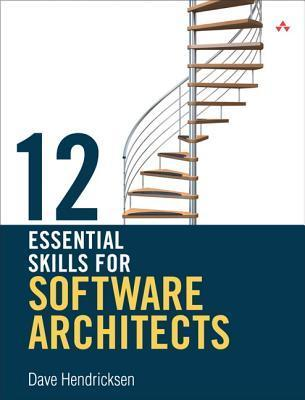 | 2011 | 9780321717290 | Book | 12 Essential Skills for Software Architects                     | [3.70](https://www.goodreads.com/book/show/13039744) | 118 | Dave Hendricksen |
| | 2010 | 9780201703726 | Book | Documenting Software Architectures: Views and Beyond            | [3.71](https://www.goodreads.com/book/show/223911) | 174 | Paul Clements, et al. |
| | 2008 | 9780470167748 | Book | Software Architecture: Foundations, Theory, and Practice        | [3.81](https://www.goodreads.com/book/show/6329721) | 65 | Richard N. Taylor, et al. |
| | 2007 | 9780132344821 | Book | SOA: Principles of Service Design                               | [3.72](https://www.goodreads.com/book/show/1265221) | 130 | Thomas Erl |
| | 2005 | 9780321112293 | Book | Software Systems Architecture: Views and Perspectives           | [4.12](https://www.goodreads.com/book/show/223932) | 205 | Nick Rozanski, Eóin Woods |
| | 2005 | 9780131858589 | Book | Service-Oriented Architecture: Concepts and Technology          | [3.65](https://www.goodreads.com/book/show/70147) | 170 | Thomas Erl |
| | 2002 | 9780321127426 | Book | Patterns of Enterprise Application Architecture                 | [4.11](https://www.goodreads.com/book/show/70156) | 3893 | Martin Fowler |
| | 1996 | 9780201895421 | Book | Analysis Patterns: Reusable Object Models                       | [3.84](https://www.goodreads.com/book/show/85002) | 275 | Martin Fowler |

---

## Tactical Design & Component Modeling
*The "Micro" layer: Code organization, SOLID principles, and reusable design patterns.*

|Image | Publ.| ISBN          | Type | Title                                             | Rating                                               | Raters | Authors                        |
| :--- | :--- | :------------ | :--- | :------------------------------------------------ | :--------------------------------------------------- | :---   | :----------------------------- |
| | 2021 | 9781492077992 | Book | Head First Design Patterns (Updated)              | [4.30](https://www.goodreads.com/book/show/58128)    | 09038  | Eric Freeman, Elisabeth Robson |
| | 2019 | 0000000000000 | Book | Dive Into Design Patterns                         | [4.78](https://www.goodreads.com/book/show/43125355) | 00772  | Alexander Shvets               |
| | 2004 | 9780321213358 | Book | Refactoring to Patterns                           | [4.05](https://www.goodreads.com/book/show/85041)    | 01399  | Joshua Kerievsky               |
|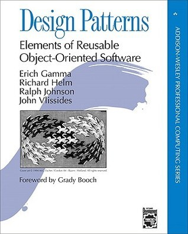 | 1994 | 9780201633610 | Book | Design Patterns: Elements of Reusable OO Software | [4.19](https://www.goodreads.com/book/show/85009)    | 10293  | Gamma, Helm, Johnson, Vlissides|

---

## Domain Driven Design
*The "Logic" layer: Aligning technical boundaries with business realities.*

|Image | Publ.| ISBN          | Type | Title                                      | Rating                                               | Raters | Authors |
| :--- | :--- | :------------ | :--- | :----------------------------------------- | :--------------------------------------------------- | :--- | :--- |
| | 2016 | 9780134434421 | Book | Domain-Driven Design Distilled             | [3.78](https://www.goodreads.com/book/show/28602719) | 1331 | Vaughn Vernon |
|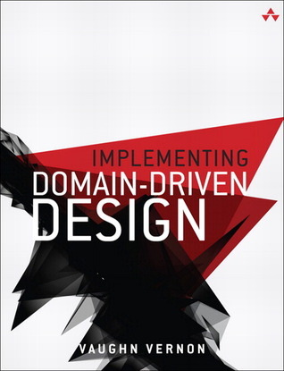 | 2013 | 9780321834577 | Book | Implementing Domain-Driven Design          | [4.06](https://www.goodreads.com/book/show/15756865) | 1302 | Vaughn Vernon |
|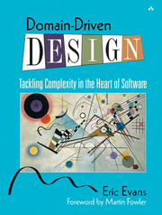 | 2003 | 9780321125217 | Book | Domain-Driven Design: Tackling Complexity  | [4.16](https://www.goodreads.com/book/show/179133)   | 5849 | Eric Evans |

---

## Microservices & Distributed Patterns
*The "Macro" layer: Communication, consistency, and service decomposition.*

|Image | Publ. | ISBN          | Type  | Title                                | Rating                                               | Raters | Authors |
| :--- | :---  | :------------ | :-----| :----------------------------------- | :----------------------------------------------------| :----  | :------ |
| | 2021  | 9781492034025 | Books | Building Microservices (2nd Ed)      | [4.49](https://www.goodreads.com/book/show/22512931) | 1240   | Sam Newman |
| | 2019  | 9781492047841 | Books | Monolith to Microservices            | [4.33](https://www.goodreads.com/book/show/44144499) | 1452   | Sam Newman |
|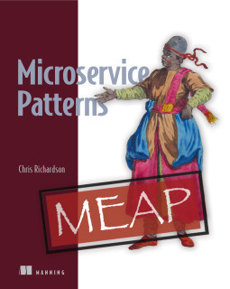 | 2018  | 9781617294549 | Books | Microservice Patterns                | [4.19](https://www.goodreads.com/book/show/34372564) | 1185   | Chris Richardson |
| | 2003  | 9780321200686 | Books | Enterprise Integration Patterns      | [4.12](https://www.goodreads.com/book/show/85039)    | 2752   | Hohpe, Woolf |

## Streaming and Messaging
*"The truth is the log. The database is a cache of a subset of the log."*

|Image | Publ.| ISBN          | Type | Title                               | Rating                                               | Raters | Authors                                  |
| :---| :--- | :------------ | :--- | :---------------------------------- | :--------------------------------------------------- | :----- | :--------------------------------------- |
|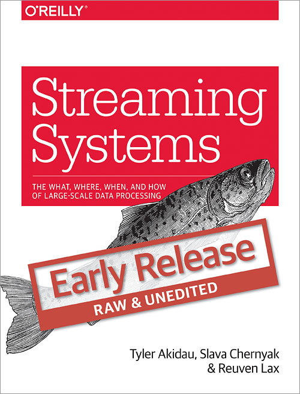 | 2018 | 9781491983874 | Book | Streaming Systems                   | [3.92](https://www.goodreads.com/book/show/34431414) | 106    | Tyler Akidau, Slava Chernyak, Reuven Lax |
|| 2018 | 9781492038221 | Book | Designing Event-Driven Systems      | [3.80](https://www.goodreads.com/book/show/39793332) | 190    | Ben Stopford                             |
|| 2016 | 9781491940105 | Book | Making Sense of Stream Processing   | [4.31](https://www.goodreads.com/book/show/29598815) | 143    | Martin Kleppmann                         |
|| 2003 | 0785342200683 | Book | Enterprise Integration Patterns     | [4.10](https://www.goodreads.com/book/show/85012)    | 1388   | Gregor Hohpe, Bobby Woolf                |

---

## Data Engineering & Persistence Strategies
*The "State" layer: How data is stored, moved, and scaled across distributed nodes.*

|Image | Publ.| ISBN          | Type | Title                                   | Rating                                               | Raters | Authors |
| :---| :--- | :------------ | :--- | :-------------------------------------- | :--------------------------------------------------- | :--- | :--- |
|| 2019 | 9781492040347 | Book | Database Internals: A Deep Dive         | [4.26](https://www.goodreads.com/book/show/44647144) | 0178 | Alex Petrov |
|| 2017 | 9781449373320 | Book | Designing Data-Intensive Applications   | [4.72](https://www.goodreads.com/book/show/23463279) | 4385 | Martin Kleppmann |
|| 2015 | 9781617290343 | Book | Big Data: Principles and Best Practices | [3.82](https://www.goodreads.com/book/show/13421400) | 0440 | Nathan Marz |

---

## Cloud Native & Resiliency Engineering
*The "Infrastructure" layer: Observability, automation, and handling failures at scale.*

|Image | Publ.| ISBN          | Type | Title                           | Rating                                               | Raters | Authors |
| :--- | :--- | :------------ | :--- | :------------------------------ | :--------------------------------------------------- | :---   | :--- |
|| 2019 | 9781492050285 | Book | Kubernetes Patterns             | [4.27](https://www.goodreads.com/book/show/44144501) | 0101   | Bilgin Ibryam, Roland Huß |
|| 2016 | 9781491929124 | Book | Site Reliability Engineering    | [4.23](https://www.goodreads.com/book/show/27968891) | 1980   | Beyer, Jones, Petoff, Murphy |
|| 2016 | 9781491924358 | Book | Infrastructure as Code          | [4.20](https://www.goodreads.com/book/show/26544394) | 0316   | Kief Morris |
|| 2007 | 9780978739218 | Book | Release It!: Design and Deploy  | [4.26](https://www.goodreads.com/book/show/1069827)  | 2746   | Michael Nygard |

---

## Socio-Technical Architecture & Leadership
*The "Human" layer: Conway's Law, team topologies, and bridging tech with business.*

|Image | Publ.| ISBN          | Type | Title                                           | Rating                                               | Raters | Authors                  |
| :--- | :--- | :------------ | :--- | :---------------------------------------------- | :--------------------------------------------------- | :----  | :----------------------- |
|| 2020 | 9781492077541 | Book | The Software Architect Elevator                 | [4.48](https://www.goodreads.com/book/show/49828197) | 00101  | Gregor Hohpe |
|| 2019 | 9781950508624 | Book | Team Topologies                                 | [3.59](https://www.goodreads.com/book/show/60502272) | 00217  | Matthew Skelton, Manuel Pais |
|| 1995 | 9780201835953 | Book | The Mythical Man-Month (Anniversary Ed)         | [4.03](https://www.goodreads.com/book/show/13629)    | 12295  | Frederick P. Brooks Jr. |

## General Articles and Books and Posts

|Image | Publ.| ISBN          | Type | Title                                               | Rating                                               | Raters | Authors |
| :--- | :--- | :------------ | :--- | :-------------------------------------------------- | :--------------------------------------------------- | :---   | :--- |
|| 2020 | 9781492082798 | Book | Software Engineering at Google                      | [4.19](https://www.goodreads.com/book/show/48816586) | 344    | Titus Winters, Tom Manshreck, Hyrum Wright |
|| 2020 | 9781735266534 | Book | 14 Habits of Highly Productive Developers           | [4.05](https://www.goodreads.com/book/show/54438214) | 195    | Zeno Rocha |
|| 2020 | 9781492056706 | Book | Container Security: Fundamental Technology Concepts | [4.48](https://www.goodreads.com/book/show/48816583) | 52     | Liz Rice |
|| 2019 | 9781942788768 | Book | The Unicorn Project                                 | [4.13](https://www.goodreads.com/book/show/44333183) | 4927   | Gene Kim |
|| 2019 | 9780596522698 | Book | 97 Things Every Software Architect Should Know      | [3.62](https://www.goodreads.com/book/show/5487765)  | 686    | Richard Monson-Haefel |
|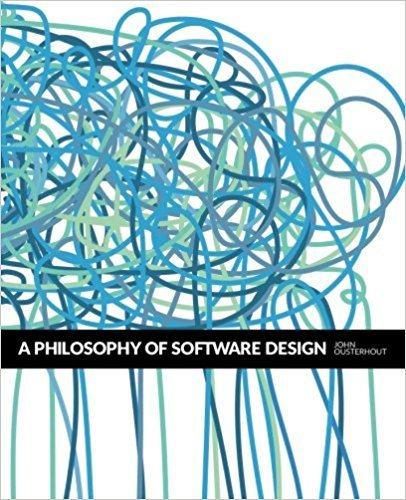| 2018 | 9781732102200 | Book | A Philosophy of Software Design                     | [4.14](https://www.goodreads.com/book/show/39996759) | 1516   | John Ousterhout |
|| 2018 | 9781492029502 | Book | The Site Reliability Workbook                       | [4.34](https://www.goodreads.com/book/show/39687146) | 231    | Betsy Beyer, Niall Richard Murphy, et al. |
|| 2018 | 9781680502725 | Book | Software Design X-Rays: Fix Technical Debt          | [4.20](https://www.goodreads.com/book/show/36517037) | 112    | Adam Tornhill |
|| 2018 | 9781661212568 | Book | Composing Software                                  | [3.88](https://www.goodreads.com/book/show/43429039) | 85     | Eric Elliott |
|| 2017 | 9781491992395 | Book | Chaos Engineering                                   | [4.23](https://www.goodreads.com/book/show/35516296) | 112    | Casey Rosenthal, Nora Jones |
|| 2017 | 9780596529307 | Book | High Performance Web Sites                          | [4.15](https://www.goodreads.com/book/show/1681559)  | 690    | Steve Souders |
|| 2016 | 9781491929124 | Book | Site Reliability Engineering: Google SRE            | [4.23](https://www.goodreads.com/book/show/27968891) | 1980   | Beyer, Jones, Petoff, Murphy |
|| 2016 | 9780735618794 | Book | Software Requirements: Practical Techniques         | [4.10](https://www.goodreads.com/book/show/349416)   | 713    | Karl Wiegers, Joy Beatty |
|| 2016 | 9781537082981 | Book | 37 Things One Architect Knows                       | [4.35](https://www.goodreads.com/book/show/29499887) | 100    | Gregor Hohpe |
|| 2014 | 9780134052502 | Book | The Software Craftsman: Professionalism             | [4.33](https://www.goodreads.com/book/show/23215733) | 769    | Sandro Mancuso |
|| 2013 | 9781449344764 | Book | High Performance Browser Networking                 | [4.50](https://www.goodreads.com/book/show/17985198) | 671    | Ilya Grigorik |
|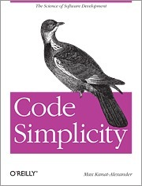| 2012 | 9781449313890 | Book | Code Simplicity: Fundamentals of Software           | [3.74](https://www.goodreads.com/book/show/13234063) | 501    | Max Kanat-Alexander |
|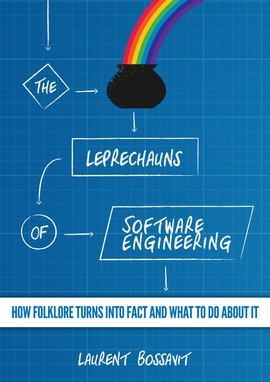| 2012 | 9782954745503 | Book | The Leprechauns of Software Engineering             | [3.84](https://www.goodreads.com/book/show/15874425) | 147    | Laurent Bossavit |
|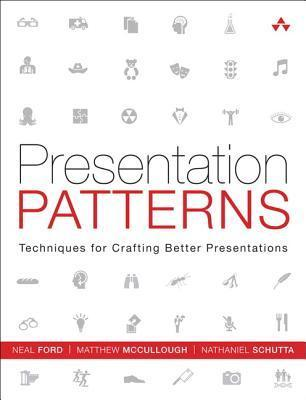| 2012 | 9780321820808 | Book | Presentation Patterns                               | [3.94](https://www.goodreads.com/book/show/13705465) | 123    | Neal Ford, Matthew McCullough, et al. |
|| 2010 | 9780201362985 | Book | The Design of Design: Essays                        | [3.76](https://www.goodreads.com/book/show/7157080)  | 571    | Frederick P. Brooks Jr. |
|| 2007 | 9780978739218 | Book | Release It!: Design and Deploy                      | [4.26](https://www.goodreads.com/book/show/1069827)  | 2746   | Michael T. Nygard |
|| 2006 | 9780735605350 | Book | Software Estimation: Demystifying the Black Art     | [4.04](https://www.goodreads.com/book/show/93891)    | 911    | Steve McConnell |
|| 2006 | 9780321356703 | Book | Software Security: Building Security in             | [3.63](https://www.goodreads.com/book/show/760789)   | 82     | Gary McGraw |
|| 2005 | 9780974514048 | Book | Ship It!: A Practical Guide                         | [3.72](https://www.goodreads.com/book/show/363086)   | 509    | Jared Richardson, Will Gwaltney |
|| 2003 | 9780932633606 | Book | Waltzing with Bears: Managing Risk                  | [3.97](https://www.goodreads.com/book/show/665153)   | 702    | Tom DeMarco, Timothy Lister |
|| 2003 | 9780201775945 | Book | Beyond Software Architecture                        | [3.72](https://www.goodreads.com/book/show/224132)   | 141    | Luke Hohmann |
|| 1999 | 9780201616224 | Book | The Pragmatic Programmer                            | [4.32](https://www.goodreads.com/book/show/4099)     | 17379  | Andrew Hunt, David Thomas |
|| 1995 | 9780201835953 | Book | The Mythical Man-Month                              | [4.03](https://www.goodreads.com/book/show/13629)    | 15165  | Frederick P. Brooks Jr. |

---

### 💡 Summary of the Literature Evolution
This list reflects the maturation of the technology industry:

1. **90s / Early 2000s:** Focus on project methodology and individual pragmatism.
2. **Mid-2000s:** Emphasis on web performance and software estimation.
3. **2010 – 2015:** Emergence of Software Craftsmanship and high-performance networking.
4. **2016 – Present:** Dominance of concepts such as SRE, Chaos Engineering, Container Security, and socio-technical impact (as seen in The Unicorn Project).

**Note:** Image Generation mode is active — if you'd like a visual representation or a custom cover for this roadmap, just let me know!

---

## 📜 License

Distributed under the **MIT License**. See `LICENSE` for more information.

Created for the global Software Architecture community.